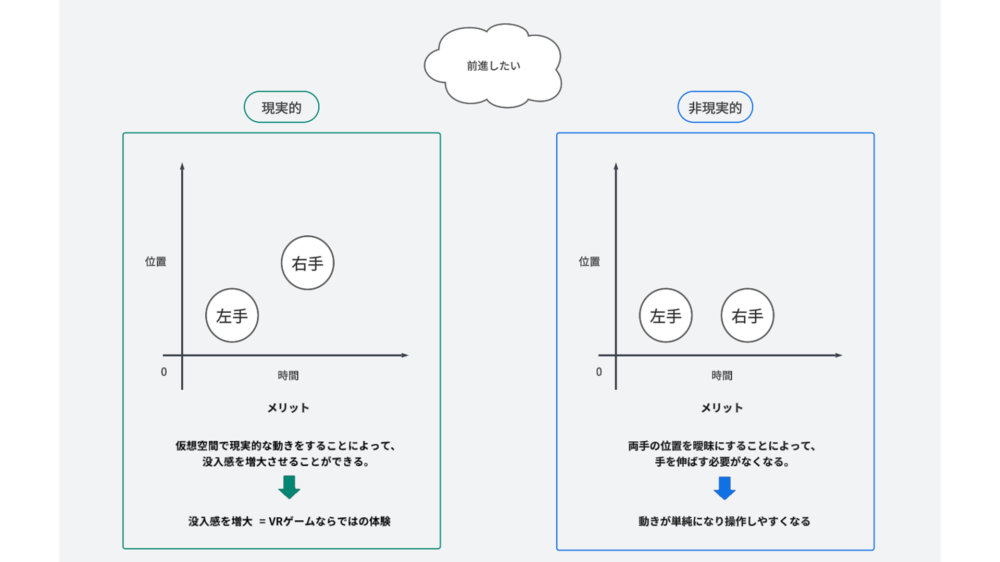
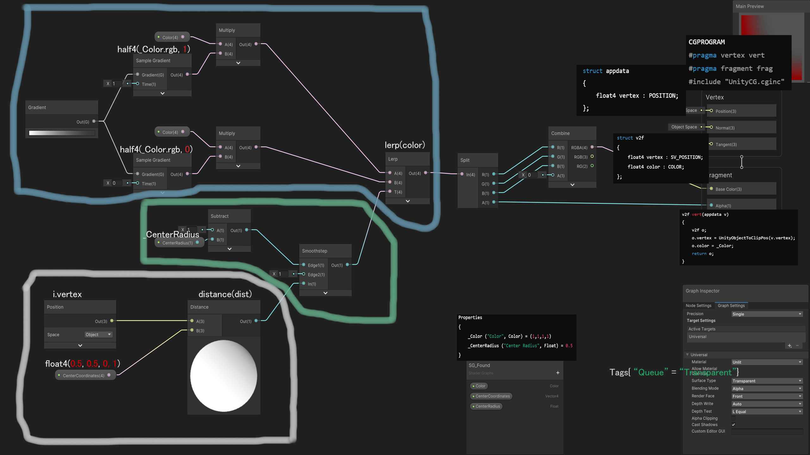
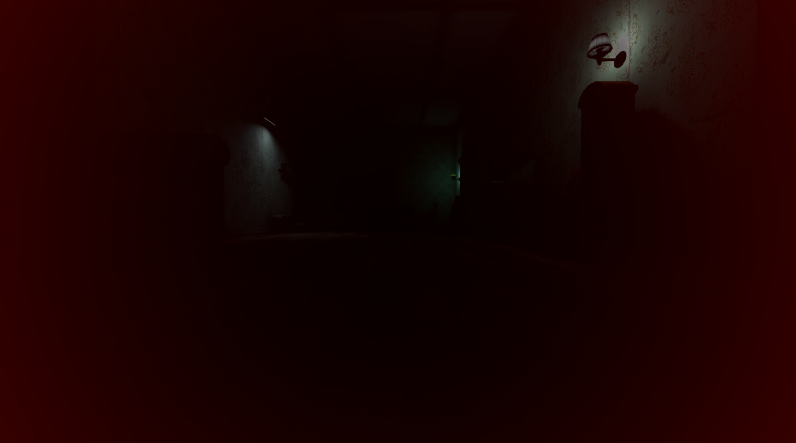
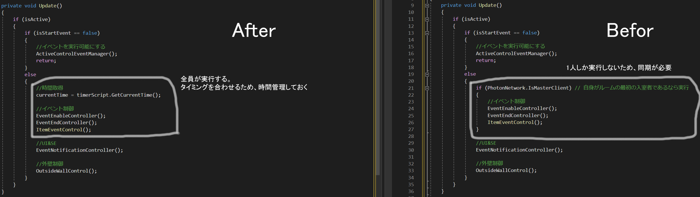
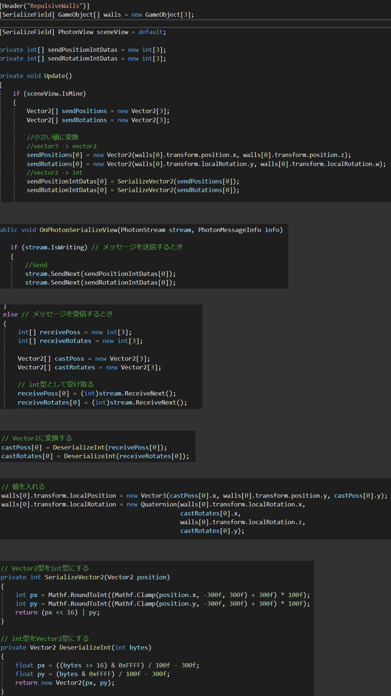

-----
# 【PORTFOLIO】

-----
## 【自己紹介】

閲覧いただきありがとうございます。藤嶌 諒と申します。

私がゲーム作りを行う目的は、「自身とユーザーを満足させるゲームを作る」ことです。

大切にしている言葉は「Trust me」と「ゲーム作りを楽しめ」です。

私はReal Glitterというチーム名義でゲームを制作しています。チームのコアメンバーは私と兄の2人です。
* 私たちは互いにゲームデザインを担い、ゲームを面白くするために基本的に週1回の意見交換を設け、活発なイテレーションを行ってきました。
* 3Dモデルや2Dアート等の二人では補えない要素は、兄の知人に協力していただくことによってゲームをさらに面白いものにすることが出来ました。
* チーム制作を通して、技術面以外の部分でも多くのことを学びました。

-----
## 【BAB】

### 1. 情報
* タイトル : BAB
* [販売サイト(Steam)](https://store.steampowered.com/app/2919580/BAB/)
* ジャンル : VR間違い探しアクションホラー
* 人数 : シングルプレイ
* プラットフォーム : SteamVR
* プレイスタイル : エリア固定, 着席 
* 制作期間 : 2022年7月 ~ 2024年5月
* 制作環境 : Windows11, Unity
* 担当 : プログラミング全般, ゲームデザイン 

### 2. BABとは
* BABとは赤ちゃんになって、奇妙な館から脱出することを目標とした、VR間違い探しアクションホラーです。
* 間違い探しがメインのゲームシステムになっており、間違いを見つけることによってゲームは進行していきます。
* ホラー要素も用意されており、ハラハラしながら遊べる内容となっています。

### 3. ゲームデザイン

#### ハイハイ

**"ハイハイ : 酔わない移動"**

* ゲーム制作を始める前に、VRゲームをいくつかプレイして「移動できるVRゲームは酔いやすい」ということに気づきました。
* プレイ中に酔ってしまうことはゲームに集中することが出来なくなり、ゲーム体験を適切にプレイヤーに届けることが出来ないと考えました。
* 私たちは仮想空間を自由に動ける楽しさを残しつつも、酔わないゲームを作ることに決めました。

**"ハイハイ : 移動"**

* 兄は「手を使った動き」から着想を得て、ハイハイを移動に使うことを考えつきました。
* 私は「酔わない」システムを制作するために、「酔わないシステム」とは何かについて考えていました。

私がたどり着いた酔わないシステムの考えは、以下の条件を全て満たすものです。
* プレイヤーの想像とゲームでの結果が同一である。
* 体を動かす。

(例 : ハイハイ)
* ゲーム内の地面に仮想の手を着く 
* 手を交互に地面に着ける (体を動かす)
* プレイヤーはハイハイを想像できる (想像)
* ゲーム内でハイハイするように進行する (結果と同一)

私の考えは兄のアイデアを補強するような形で活かされました。
また、この考えはゲームシステムを制作する前の段階で、酔うか酔わないかを判断できる材料の1つとなりました。

### 4. 技術

#### ハイハイシステム : 現実的vs非現実的

* この問題は「後ろハイハイ」の作成中に発生しました。
* プレイヤーが前に進みたいのか、後ろに進みたいのかを明確にさせるために、手を着いたときの両手の位置に着目しました。

* どちらのシステムも試した後、私たちは「操作性の良さ」を優先させました。ハイハイは一般的にゲームにおいて親しみのない操作であるため、プレイヤーのやりやすさを重視すべきと判断したためです。
* ハイハイの操作がやりやすいものになることによって、ハイハイをストレスなく楽しめるものに作りあげることが出来ました。

#### カメラエフェクト(画面効果)

* プレイヤーの状態を分かりやすくプレイヤーに伝えるために、カメラエフェクトが必要となりました。
* Unityには「ポストプロセスエフェクト」という機能があります。これを使用すればカメラエフェクトを実装することはできたのですが、使用するとフレームレートが低下したため使用はしませんでした。
* 結果的に私はシェーダーグラフを使用して、カメラエフェクトを作ることにしました。

**"「見られている」ことを伝えるエフェクトを作る"**
* 当初、私は作りたい内容をいくつかに分け、部分的にノードや繋ぎ方を集め、それらを組み合わせて目標となるエフェクトのシェーダーグラフを完成させようとしていました。
* 今までは組み合わせによるシェーダーグラフの作成で上手くいっていたのですが、この時は組み合わせに使用するシェーダーグラフが見つからなかったため断念しました。
* 私はChatGPTでシェーダーコードを生成させ、出力されたコードを最低限理解し、シェーダーグラフを作ることに決めました。

作成したシェーダーグラフ

作成したカメラエフェクト

-----
## 【Push Battle】

### 情報
* タイトル : Push Battle
* [販売サイト(Steam)](https://store.steampowered.com/app/1825700/Push_Battle/)
* ジャンル : 尻相撲バトルアクションカジュアル
* 人数 : マルチプレイ(最大4人)、シングルプレイ
* プラットフォーム : Windows 
* 制作期間 : 2020年12月 ~ 2022年7月
* 制作環境 : Windows10, Unity
* 担当 : プログラミング全般, ゲームデザイン

### Push Battleとは
* Push Battleはお尻の妖精である「ケップリン」を操作し、他のキャラクターにお尻をぶつけてフィールドから落とす、カジュアルなマルチプレイアクションゲームです。

### マルチプレイの実装
* 私はPUN2(Photon Unity Networking 2)を使用しマルチプレイを実装しました。実装方法は公開されているチュートリアルと公式リファレンスを通じて学び始めました。
* マルチプレイの導入は想像よりも簡単でしたが、問題が発生したときの対応はとても大変でした。
* 以下はPUN2環境での内容です。他のサービスの場合は異なる場合がありますので、ご了承ください。

#### ゲームの不整合
* ゲームリリース後に操作するキャラクターが消えたり、出現したりを繰り返す問題が発生しました。そして、これは別のプレイヤーからは確認できないという内容でした。
* 私はいくつかの理由から、同期処理に問題があり、その結果、問題である事象が発生しているのではないかと想定しました。

**"秒間メッセージ数を減らす : 解決策を決める"**
* 私は同期処理を改善するために、PUN2について調べ、秒間メッセージ数を知りました。秒間メッセージ数には以下の注意点がありました。

1. 「1ルームの秒間メッセージ数は500まで」という制限
   * 制限を超過した場合は追加の課金と修正を依頼される場合があるため、秒間メッセージ数は500を超えないように作る必要がありました。
   * 秒間メッセージ数が多いとパフォーマンスに問題が生じる可能性があるため、改善することにより同期処理を改善させることが期待できました。

2. 秒間メッセージ数が多いとパフォーマンスに影響が出る
   * パフォーマンスの影響は主に、メッセージ数が多いとクライアントが処理することができず、メッセージの受信に漏れが発生し、同期を正しく行えないというものでした。

* 改善前の秒間メッセージ数は1392でした。これは制限を超えていました。
* 公式リファレンスには「秒間メッセージ数が多くなりすぎるとパフォーマンスに影響を及ばす」と記載されていたため、具体的な数値は記載されていなかったのですが、制限の500はソフトキャップと呼ばれてもいたため、
1392という数値は「多くなりすぎる」に該当すると判断しました。
* 私は同期処理を改善するために、秒間メッセージ数を減らすことを解決策としました。

**"秒間メッセージ数を減らす : 最適化"**
* 私が最適化するために選んだ手法は「ローカル化」と「小さいデータ型を送信する」です。
* この2つの手法を選ん理由は仕組みが分かりやすかったためです。問題を解決するために、新しい問題が発生することを恐れていたため、分かりやすささは重要でした。

[スクリプトの一部抜粋]

[スクリプトの一部抜粋]

* 約1カ月の期間を費やすことにより、秒間メッセージ数を1392から240まで減らすことに成功しました。
* 最終的に、友人に協力していただき、問題は発生していないのかを検証を行い、問題はなく、状態を一致させることができました。
* この経験で「リリース前に、実際の環境を想定してプレイテストをする重要性」に気づかされました。

### Push Battle まとめ
* マルチプレイの問題の修正は、作成したスクリプトを見直し、改善方法を考え、修正するという細かい作業であったため、根気を必要とする作業でした。
私は遊べるゲームをプレイヤーに届けたいという気持ちがあったからこそ、作業をやり遂げることが出来たと思います。

-----
## 【おわりに】

私は「目的を達成させたい」という気持ちが今も燃えています。
これからも、ゲーム作りの知識だけでなく、人としても多くのことを学びながらゲーム制作を続けていきたいです。

-----
## 【BABに使用したスクリプト】
[フォルダ](Scripts/BAB)

-----
## 【License】

### Code
This project is licensed under the MIT License - see the [LICENSE](LICENSE) file for details.

### Media Files
All images, GIFs, and videos included in this repository are copyrighted by their respective owners and are provided here solely for educational and illustrative purposes. They may not be copied, modified, or redistributed without explicit permission from the copyright holder.
