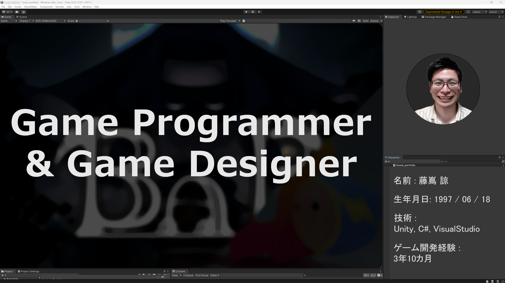

# 【ポートフォリオ】

## 【自己紹介】
閲覧いただき、ありがとうございます。藤嶌 諒です。

私はUnityを使用してチームでゲーム制作をしています。

私がゲーム作りを行う目的は、「自身とユーザーを満足させるゲーム」を作ることです。

大切にしている言葉は「Trust me」と「ゲーム作りを楽しめ」です。

私の趣味はゲームです。最近プレイしたゲームは「Coffee Talk」です。ゲームで登場する「生姜コーヒー」を実際に作ったのですが、とても美味しかったです。生姜は少し多めくらいがオススメです。

私はVRに興味があり、最近はフェイシャルトラッカーを使用して「笑ってはいけないVR」というゲームを作ったら面白そうではないか？と妄想を膨れませました。

私はReal Glitterというチーム名義でゲームを制作しています。チームのコアメンバーは私と兄の2人です。

チームでのゲーム制作を通して以下を学びました。
* **リスペクトの必要性** : リスペクトすることによって、相手の意見を無下にしなくなりアイデアの発展に繋がる。リスペクトがあることによって気持ち良く協力しゲーム制作を行うことができる。 
* **アイデアの融合** : 異なるアイデアをぶつけ合い優れたアイデアを選択する以外にも、融合させることによってアイデアを面白くできる。
* **話し合うときの議題を決める** : ミーティングをする前に議題を決めたおくことによって円滑に進行できるようになる。円滑に進むことによって脳が疲弊する前に問題解決を行うことができる。
* **連絡する際のメッセージに付ける絵文字の重要性** : 絵文字を付けることによって柔らかい表現をすることができ、コミュニケーションを円滑に行える場合がある。
* **心に余裕を持つことの大切さ** : 余裕を持って会話することによって無駄な会話(言葉に言葉を返す)に発展しなくなり、有意義な会話を行うことができる。
* **よく話しを聞くこと** : 
	* 話しを聞くことによって、比較的話しやすい人間になれる。話しやすい人間になることでチームでのアイデア、意見、問題等の交換が活発になりゲームを面白くできる機会が増える。
	* 相手の話しを理解し、理解できないときは質問やその意見に対する見解を述べることによって会話のすれ違いを防ぎ、気持ちの良いコミュニケーションが可能になると共に問題解決をスムーズに行える。
	* 人によって異なる場合もあるが、相手の話しを聞くことによって自身の話しを聞いてくれる可能性が増し、意見を通しやすくなる。
* **熱量は凄く大切だが、言葉は柔らかく、頭は冷静である必要があること** :
	* 熱量の大切さ : 熱量があることによって、耳を傾けてくれる可能性が増す。自身のアイデアを通しやすくなる。
	* 言葉の柔らかさの大切さ : 相手を不快にさせずに済む。意見をぶつけることは大切だが、相手を傷つける必要はない。
	* 冷静であることの大切さ : 冷静で無い場合、問題設定を誤り、正しく問題解決を行えずゲームを面白くするイテレーションに支障が出る。また、心に余裕がなくなり建設的な話し合いが出来なくなる。

現在の私の課題
* "私のゲーム作りの目的を正確に捉える"
* "技術力を向上させる"
* "人と繋がり知見を得る"
* "ゲームデザインを研鑽する"
* "色々なことに挑戦し楽しむ！"

## 【VR Game Project】

### 情報
* タイトル : BAB
* [販売サイト(Steam)](https://store.steampowered.com/app/2919580/BAB/)
* ジャンル : VR間違い探しアクションホラー
* 人数 : シングルプレイ
* プラットフォーム : SteamVR
* 制作期間 : 2022年7月 ~ 2024年5月
* 制作環境 : Windows11, Unity
* 担当 : プログラミング全般、ゲームデザイン 

## License

### Code
This project is licensed under the MIT License - see the [LICENSE](LICENSE) file for details.

### Media Files
All images, GIFs, and videos included in this repository are copyrighted by their respective owners and are provided here solely for educational and illustrative purposes. They may not be copied, modified, or redistributed without explicit permission from the copyright holder.
