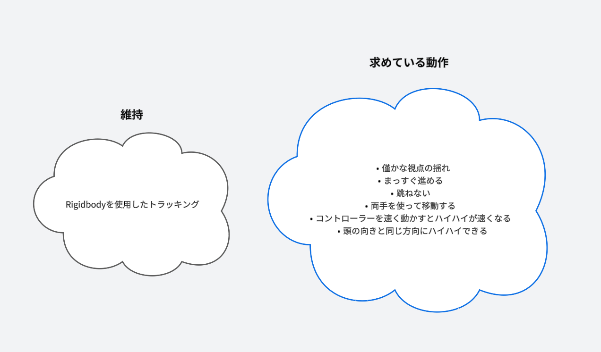
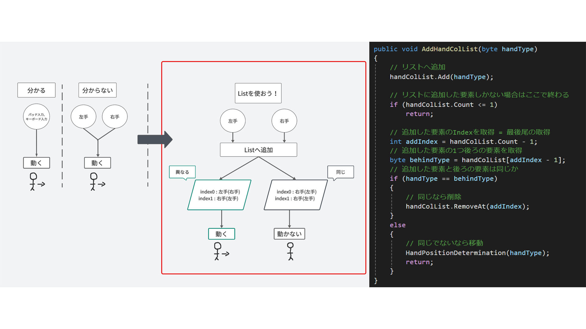
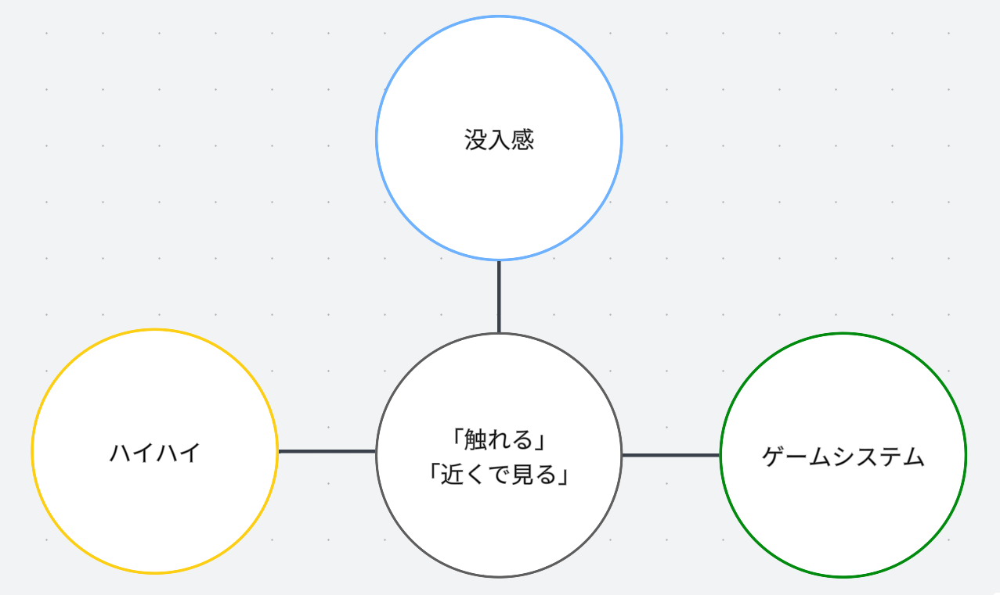
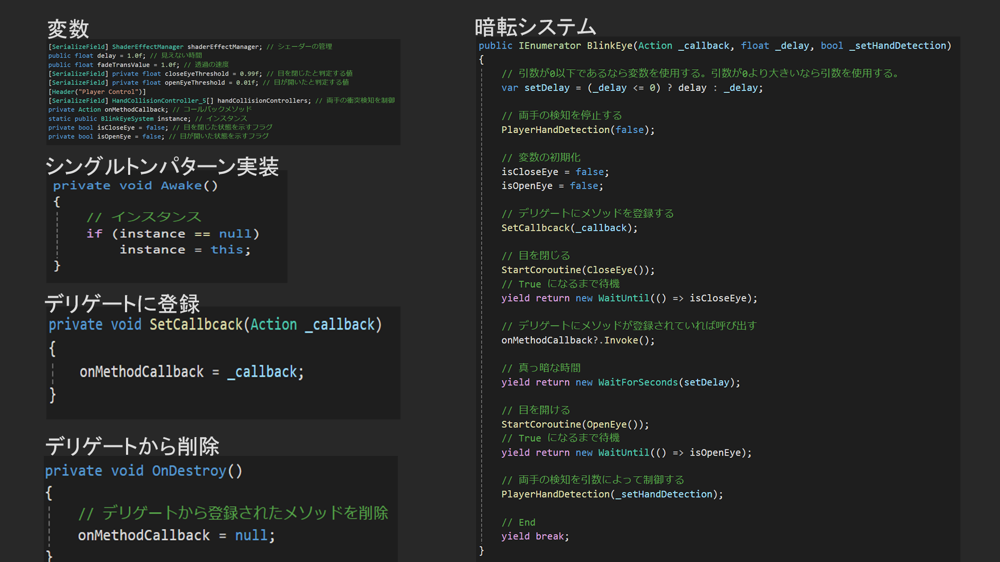
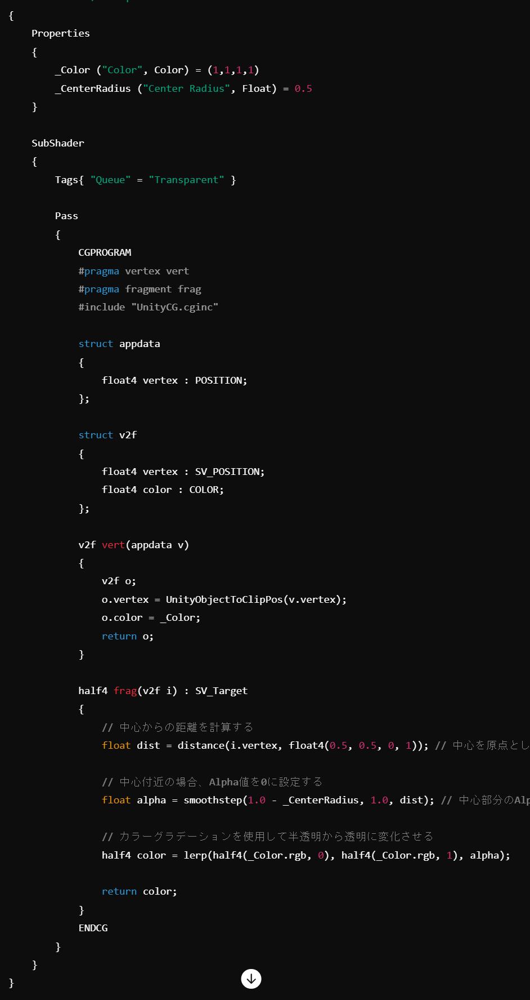
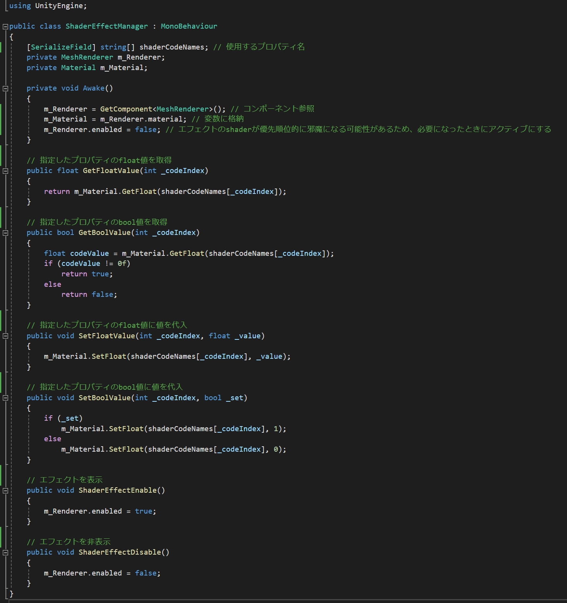
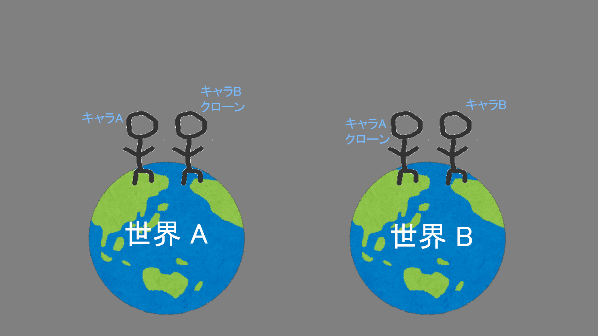
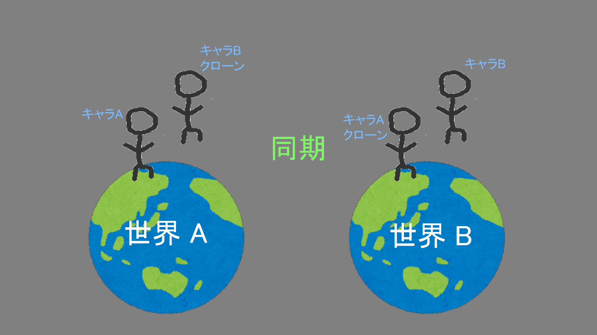
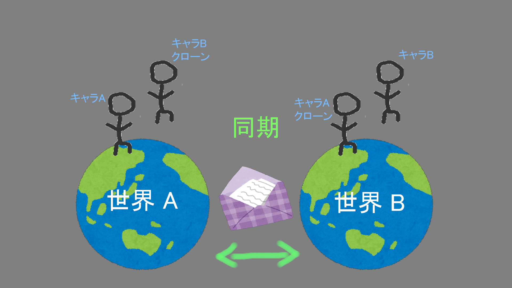

# 【PORTFOLIO】

## 【自己紹介】
閲覧いただき、ありがとうございます。藤嶌 諒です。

私はUnityを使用してチームでゲーム制作をしています。

私がゲーム作りを行う目的は、「自身とユーザーを満足させるゲームを作る」ことです。

大切にしている言葉は「Trust me」と「ゲーム作りを楽しめ」です。

私の趣味はゲームです。最近プレイしたゲームは「Coffee Talk」です。ゲームで登場する「生姜コーヒー」を実際に作ったのですが、とても美味しかったです。生姜は少し多めくらいがオススメです。

私はVRに興味があり、最近はフェイシャルトラッカーを使用して「笑ってはいけないVR」というゲームを作ったら面白そうではないか？と妄想を膨れませました。

## 【Real Glitter】 
私はReal Glitterというチーム名義でゲームを制作しています。チームのコアメンバーは私と兄の2人です。
* 私たちは互いにゲームデザインを担い、ゲームを面白くするために基本的に週1回の意見交換を設け、活発なイテレーションを行ってきました。
* 3Dモデルや2Dアート等の二人では補えない要素は、兄の知人に協力していただくことによってゲームをさらに面白いものにすることが出来ました。
* チーム制作を通して、技術面以外の部分でも多くのことを学びました。

## 【BAB】

### 情報
* タイトル : BAB
* [販売サイト(Steam)](https://store.steampowered.com/app/2919580/BAB/)
* ジャンル : VR間違い探しアクションホラー
* 人数 : シングルプレイ
* プラットフォーム : SteamVR
* プレイスタイル : エリア固定, 着席 
* 制作期間 : 2022年7月 ~ 2024年5月
* 制作環境 : Windows11, Unity
* 担当 : プログラミング全般, ゲームデザイン 

### BABとは
* BABとは赤ちゃんになって、奇妙な館から脱出することを目標とした、VR間違い探しアクションホラーです。
* 間違い探しがメインのゲームシステムになっており、間違いを見つけることによってゲームは進行していきます。
* ホラー要素も用意されており、ハラハラしながら遊べる内容となっています。

### ハイハイ

BABはハイハイで移動する。

#### ハイハイとは
VRゲームプロジェクトにはいくつかの開発課題を設定しており、これらを達成すべく試行錯誤を繰り返してきました。
ハイハイは課題の1つである「酔わない」という課題を達成すべく作成されました。

#### ハイハイの誕生
ハイハイは兄が考えつきました。兄は「手を使った動き」に着目しハイハイにたどり着きました。
私は「酔わない」システムを制作するために、「酔わないシステム」とは何かについて考えていました。

私がたどり着いた酔わないシステムの考えは、以下の条件を全て満たすものです。
* プレイヤーの想像とゲームでの結果が同一である。
* 体を動かす。

(例 : ハイハイ)
* ゲーム内の地面に仮想の手を着く 
* 手を交互に地面に着ける (体を動かす)
* プレイヤーはハイハイを想像できる (想像)
* ゲーム内でハイハイするように進行する (結果と同一)

私の考えは兄のアイデアを補強するような形で活かされました。
また、この考えはゲームシステムを制作する前の段階で、酔うか酔わないかを判断できる材料の1つとなりました。

#### ハイハイシステムの歴史
**"ハイハイシステムの歴史 1 : まずは行動"**
* ハイハイを作る最初のステップは似たシステムを探しコピペし触ることでした。
* 深く考える前に行動した理由は、私にハイハイを0から作る能力がないと判断したためです。また、似たシステムを扱うことによってインスピレーションを得られると考えました。

**"ハイハイシステムの歴史 2 : 気づきと方針"**
* コピペしたシステムを触ることによって、私が何を求めているかを明確にさせることが出来ました。そして、私の理解力では作成できない部分も分かりました。
* 求めているシステムを実現させるために、システムの新規実装とコピペシステムの一部を維持することを決定しました。

**"ハイハイシステムの歴史 3 : 立ちふさがる困難"**
* 求めているシステムを作成する上で、最も困難であったのが「両手を使って移動する」ことでした。ハイハイは両手を使って動くのが一般的であるためです。
* 困難であった理由は、当時の私の知識には「1つの入力で対象を動かす」しかなかったためです。
* この問題を解決するために「ハイハイ」という動きをよく観察しました。気づいたことは、「最初に着いた手と後に着いた手が異なる場合、進むことができる」ということでした。
* 気づきを実現するために、私の知識を全て展開し使えるものを探しました。
* 最初に見つけたのは「List」でした。Listを使用することによって前後の比較を行うことができるためです。この「前後の比較」という考えに基づき、Listは後にシンプルにするために「string」に変わります。
* こうして私は「両手で移動するハイハイ」を作ることができました。

**"ハイハイシステムの歴史 4 : 現実的vs非現実的"**
* この問題は「後ろハイハイ」の作成中に発生しました。
* プレイヤーが前に進みたいのか、後ろに進みたいのかを明確にさせるために、手を着いたときの両手の位置に着目しました。

* どちらのシステムも試した後、私たちは「操作性の良さ」を優先させました。ハイハイは一般的にゲームにおいて親しみのない操作であるため、プレイヤーのやりやすさを重視すべきと判断したためです。
* ハイハイの操作がやりやすいものになることによって、ハイハイをストレスなく楽しめるものに作りあげることが出来ました。

**"ハイハイシステムの歴史 : まとめ"**
* "ハイハイシステムの歴史"ではハイハイのシステムをいくつかピックアップして紹介させていただきました。
* ハイハイは、問題を解決しつつ段階的により良くすることによって、プレイヤーが違和感を感じず、操作性の良いアクションにすることができました。

#### ハイハイに関連するスクリプト
none

#### リファクタリングを行ったスクリプト
none

### インタラクション

BABは「触れる」と「近くで見る」ことでインタラクトできる。

#### 協調性のあるアクション
「触れる」と「近くで見る」はインタラクションのアクション部分になります。アクション単体で見るとユニークさやインパクトにも欠けるかもしれませんが、
この2つのアクションは他の要素を尊重しており、ゲームに馴染むように設計されています。

**"ボタン入力を使用しないことにより、没入感を損なわさせない"**
* ゲーム内で手に機械や装置を握っている場合はコントローラーのボタン入力を押すことに違和感はありません。
* しかし、手に何も握っていない場合にボタン入力を行うことは違和感があり、途端に「ゲームチック」に感じてしまいます。これはVR特有の「現実に近い」という利点を活かせなくなってしまいます。
* 以上の理由から、2つのアクションはボタン入力を避け、没入感を維持する工夫がされています。

**"ハイハイを活かし補う"**
* 「触れる」の利点は、ハイハイしていた状態から手を伸ばすだけで行えることです。移動とアクションがスムーズに行えるため、プレイヤーにストレスを与えず、ゲーム体験に集中してもらうことができます。
* 「近くで見る」は、手が届かない所に対してもインタラクションを可能にします。このアクションによりゲーム内の空間を最大限有効活用でき、プレイヤーにより自由さを感じさせることができます。

**"ゲームシステムに合うアクション"**
* 人は気になったものを「手に持つ」「注視する」ような行動を取ります。この行動は間違い探しにも適していると考えました。
* ゲームに導入する際に「手に持つ」「注視する」というアクションを、よりシンプルな「触れる」「近くで見る」に置き換えました。
* シンプルなものにしたは理由は、「テンポの良いゲームにしたい」「リソースを削減したい」という意図があったためです。テンポの良いゲームはプレイヤーを飽きさせないために重要であり、リソース削減は開発速度を高めるためです。

**"「触れる」と「近くで見る」"**
* このように、2つのアクションは他の要素と組み合わせることで、ゲームに馴染む自然なアクションに仕上がっています。

### 「暗転」演出

* 暗転は「プレイヤーの位置を調整したいが、勝手に動かすと酔う」という問題を抱えているときに閃きました。
* 当時、「暗転」は「まばたき」と呼んでいました。当時の私は、人間の動作に着目してアイデアを出したのでしょう。
(なぜか私は、どのように閃いたかについてはメモに残さない習性があります。)

**"暗転の価値"**

暗転について考察したとき、暗転には当初の問題を解決できる以外の価値もあることに気づきました。

1. **利便性**
* インタラクションのリアクションに使用できる
* イベント開始時の位置等の調整に使える

2. **分かりやすさ**
* 明示的な演出があることによって、「何かが起こった」ということプレイヤーに伝えられる

3. **違和感のなさ**
* 「目のまばたき」のような捉えた方もできるため違和感がない

このように暗転には、私の問題を解決する能力があると共に付加価値も持ち合わせていました。

**"学びを活かして汎用的なシステムに仕上げる"**

私は「暗転は様々な場面で使用できる利点があるのなら、汎用的なシステムにできないのか？」という疑問を抱いていました。
これを解決したのは、「シングルトンパターンとデリゲート」でした。

「シングルトンパターンとデリゲート」との出会いは、
「プログラマーとしての技術力の不安」について、ゲーム制作に協力していただいた方に相談していたときに教えていただいた学習サイトでの学びでした。

これらのシステムを知ったときは、「こんなシステムがあったのか！」という驚きと、「まばたきに使えそう！」という興奮を覚えたことを今でも覚えています。

私はこの新しいシステムを迅速に学び、ゲームに取り入れることで、汎用的な暗転システムを完成させました。

[スクリプトの一部抜粋]

この経験により、プログラマーとしての手札が増えたことを実感しました。

手札が増えることにより、ゲームはより作りやすいものとなり、そして面白いアイデアを実現しやすくなると感じました。
これからも、プログラマーとして幅広く多くのことを学び成長を続けます。

#### インタラクションに関連するスクリプト
none

#### リファクタリングを行ったスクリプト
none

### カメラエフェクト(画面効果)
* プレイヤーの状態を分かりやすくプレイヤーに伝えるために、カメラエフェクトが必要となりました。
* 一人称視点のゲームを遊んでいた経験から、画面が暗くなったり赤くなったりするものが、
私が求めるカメラエフェクトであると分かってはいたのですが実装方法に悩みました。
* Unityには「ポストプロセスエフェクト」という機能があります。これを使用すればカメラエフェクトを実装することはできたのですが、使用するとフレームレートが低下したため使用はしませんでした。
* 結果的に私は次の解決策をとりました。

**"「カメラの正面に板」"**
// add image

* これは板のマテリアルに設定されているシェーダーを操作してエフェクトを実現しようとする方法です。
* 使用していたUnityのバージョンではシェーダーグラフが実装されており、シェーダーグラフはシェーダーコードを書くよりも比較的簡単でした。
* この方法で様々なエフェクトを作ることができると、ワクワクしていたのですが現実は甘くありませんでした。

**"シェーダーグラフ : 「見られている」ことを伝えるエフェクトを作る"**
* 当初、私は作りたい内容をいくつかに分け、部分的にノードや繋ぎ方を集め、それらを組み合わせて目標となるエフェクトのシェーダーグラフを完成させようとしていました。
* 今までは組み合わせによるシェーダーグラフの作成で上手くいっていたのですが、この時は組み合わせに使用するシェーダーグラフが見つからなかったため断念しました。
* 私はChatGPTでシェーダーコードを生成させ、出力されたコードを最低限理解し、シェーダーグラフを作ることに決めました。

生成したシェーダーコード

作成したシェーダーグラフ

作成したカメラエフェクト

シェーダーを管理するスクリプト

* 単純なシェーダーグラフではありますが、シェーダーグラフを理解するための貴重な経験となりました。
* 「カメラの正面に板」をすることで、問題を無事に解決することができました。

### BAB まとめ
* BABでは多くの経験と学びがありました。ポートフォリオではその一部を紹介させていただきました。
* VRという新しいカテゴリへの挑戦はとても困難ではありましたが、制作を通してVRならではの体験に触れ、VRが作り出す体験とその未来にワクワクしました。
* 2年近くの制作期間の中で様々なゲームを作り、壊すことを繰り返し、時にはゲームデザイン方法の見直しも行いました。
ゲーム制作に費やした時間は苦しみもありましたが楽しさもあり、やはり「ゲーム制作は面白い」と今も感じています。

## 【Push Battle】

### 情報
* タイトル : Push Battle
* [販売サイト(Steam)](https://store.steampowered.com/app/1825700/Push_Battle/)
* ジャンル : 尻相撲バトルアクションカジュアル
* 人数 : マルチプレイ(最大4人)、シングルプレイ
* プラットフォーム : Windows 
* 制作期間 : 2020年12月 ~ 2022年7月
* 制作環境 : Windows10, Unity
* 担当 : プログラミング全般, ゲームデザイン

### Push Battleとは
* Push Battleはお尻の妖精である「ケップリン」を操作し、他のキャラクターにお尻をぶつけてフィールドから落とす、カジュアルなマルチプレイアクションゲームです。

### マルチプレイの実装
* 私はマルチプレイを実装するのに多くの時間を費やしたように思います。私はPUN2(Photon Unity Networking 2)を使用するために、公開されているチュートリアルと公式リファレンスを通じて学び始めました。
* マルチプレイの導入は想像よりも簡単でしたが、問題が発生したときの対応はとても大変でした。
* 以下はPUN2環境での内容です。他のサービスの場合は異なる場合がありますので、ご了承ください。

#### 世界は1つではない
* マルチプレイに実際に触れる前は、ルームに参加するというマルチプレイの性質から「1つの世界に人が集まる」と考えていましたが、これは誤りでした。
* PUN2を学ぶにつれ、マルチプレイとは「参加人数分だけ世界が存在し、オリジナルは自身のみで、他はクローンである」と考えるようになりました。
* このような考えた理由は、プレイヤーは自身のシーン(Unity Scene)で、キャラクターを動かし、それを同期させるということを知ったためです。

イメージ図

#### 同期させることによって、疑似的に1つの世界になる
* マルチプレイは基本的に、世界AでキャラクターAが動いたとき、世界BでもキャラクターAは同じように動かなけれなりません。
* これを実現させるためには各世界を同期させる必要があります。
* 同期させることにより、「1つの世界で同じ状況や状態を共有することができる感覚」を提供することができます。

イメージ図

#### メッセージのやり取りによって、同期が可能になる
* 同じ状態や状況を作るために同期が必要です。では、どのように同期は行われるのでしょうか？
* 答えはメッセージです。ネットワーク通信によって、各世界間でメッセージを送り合うことができ、同期が可能となります。
* このメッセージのやり取りは、キャラクターの位置情報やアクション等をリアルタイムで送信し合うことで実現します。
これにより、各プレイヤーの画面で同じ動作が実現されます。

イメージ図

#### ゲームの不整合
* ゲームリリース後に操作するキャラクターが消えたり、出現したりを繰り返す問題が発生しました。そして、これは別のプレイヤーからは確認できないという内容でした。
* 私はいくつかの理由から、同期処理に問題があり、その結果、問題である事象が発生しているのではないかと想定しました。

*"秒間メッセージ数を減らす : 解決策を決める"**
* 私は同期処理を改善するために、PUN2について調べ、秒間メッセージ数を減らす対応を取りました。
* 秒間メッセージ数とは、1ルームの1秒間あたりの送信したメッセージ数です。秒間メッセージ数には制限と多いときの危険性がありました。

1. 「1ルームの秒間メッセージ数は500まで」という制限
* 制限を超過した場合は追加の課金と修正を依頼される場合があるため、秒間メッセージ数は500を超えないように作る必要がありました。
* 秒間メッセージ数が多いとパフォーマンスに問題が生じる可能性があるため、改善することにより同期処理を改善させることが期待できました。

2. 秒間メッセージ数が多いとパフォーマンスに影響が出る
* パフォーマンスの影響は主に、メッセージ数が多いとクライアントが処理することができず、メッセージの受信に漏れが発生し、同期を正しく行えないというものでした。

3. 制限の2倍以上の秒間メッセージ数
* 改善前の秒間メッセージ数は1392でした。これは制限を超えていました。
* 公式リファレンスには「秒間メッセージ数が多くなりすぎるとパフォーマンスに影響を及ばす」と記載されていたため、具体的な数値は記載されていなかったのですが、制限の500はソフトキャップと呼ばれてもいたため、
1392という数値は「多くなりすぎる」に該当すると判断しました。

**"秒間メッセージ数を減らす : 最適化"**
* 私が最適化するために選んだ手法は「ローカル化」と「小さいデータ型を送信する」です。
* この2つの手法を選ん理由は仕組みが分かりやすかったためです。問題を解決するために、新しい問題が発生することを恐れていたため、分かりやすささは重要でした。

**"秒間メッセージ数を減らす : ローカル化"**
* ローカル化するということは、そのシステムを同期する必要がなくなるため、メッセージを送ることはなくなり、メッセージ数は0になります。
* システムの仕組みや、ゲームの面白さに気を配りながら、ポイントごとにローカル化を行うことにより、メッセージ数を減らすことができました。

// add image & scripts befor after

**"秒間メッセージ数を減らす : 小さいデータ型"**
* データ型ごとにメッセージ数は違いました。例えば、Vector3型のデータサイズは16で、Vector2型のデータサイズは12です。
* 複数の小さいデータは1つのメッセージにまとめられて送信されますが、大きいデータは、複数のメッセージに分割されて送信されます。これは、小さい送信データにすればメッセージ数を減らせることを意味します。
* 私は可能な限り小さいデータ型を送信することにし、送信したデータをキャストし位置や回転に置換しました。

// scripts cast 

**"秒間メッセージ数を減らす : 解決"**
* 約1カ月の期間を費やすことにより、秒間メッセージ数を1392から240まで減らすことに成功しました。
* 最終的に、友人に協力していただき、問題は発生していないのかを検証を行い、問題はなく、状態を一致させることができました。
* この経験で「リリース前に、実際の環境を想定してプレイテストをする重要性」に気づかされました。

### Push Battle まとめ
* マルチプレイの問題の修正は、本当に根気がいる作業であったと思います。作業内容は作成したスクリプトを見直し、改善方法を考え、修正するという細かい作業であったため、正直に感想を述べると苦しかったです。
私は、遊べるゲームをプレイヤーに届けたいという一心で作業を行っていたように思います。

## 【おわりに】

私は紹介したゲームを完成させてきましたが、私はゲームデザインとプログラミングの両方で未熟であると確信しています。しかし、同時に、「目的を達成させたい」という気持ちが私の中で今も燃えています。
私はこれからも、ゲーム作りの知識だけでなく、人として多くのことも学びながらゲーム制作を続けていきたいです。

## 【License】

### Code
This project is licensed under the MIT License - see the [LICENSE](LICENSE) file for details.

### Media Files
All images, GIFs, and videos included in this repository are copyrighted by their respective owners and are provided here solely for educational and illustrative purposes. They may not be copied, modified, or redistributed without explicit permission from the copyright holder.
